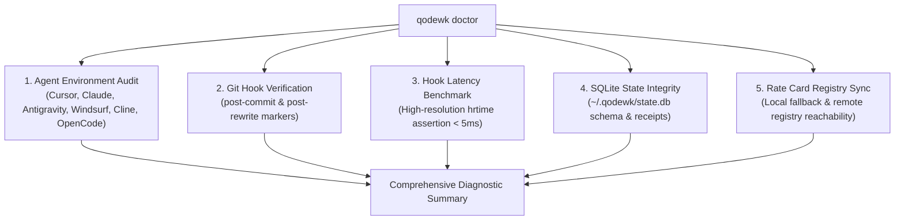

<TLDR>
Developers rely on coding agents across multiple editors and terminals—Cursor, Claude Code, Antigravity, Windsurf, Cline, and OpenCode. When telemetry fails silently or git hooks slow down `git commit`, developer trust erodes. We are introducing `qodewk doctor` and `qodewk hook test`: a unified diagnostic system that audits installed agent paths, validates SQLite state integrity, and benchmarks background git hook detachment with sub-5ms latency verification.
</TLDR>

## The Challenge of Silent Telemetry Drift

Modern software engineers rarely use just one AI tool. On a single development laptop, you might find:
- **Cursor** handling interactive diff generation in its dedicated IDE fork.
- **Claude Code CLI** refactoring whole subsystems in the terminal.
- **Google Antigravity** coordinating multi-step agent workflows.
- **Cline / Roo Code** running autonomous tool loops inside VS Code.
- **Aider** executing paired terminal commits.

Because each platform stores session transcripts, SQLite databases, and token counters in distinct operating-system locations, developers often wonder:
> *"Is Qodewk actually discovering my Cursor database? Did the post-commit hook install correctly? Is my commit latency being penalized?"*

To answer these questions definitively with zero guesswork, we designed `qodewk doctor`.

---

## What `qodewk doctor` Evaluates

Running `npx qodewk doctor` executes an immediate, non-invasive health check across five operational subsystems:



### 1. Multi-Agent Footprint Discovery
The diagnostic engine inspects known filesystem roots for active agent telemetry:
- **Google Antigravity:** Checks `ANTIGRAVITY_APP_DATA_DIR` and `~/.gemini/antigravity`.
- **Claude Code CLI:** Checks `~/.claude/projects/` for JSONL transcript streams.
- **Cursor IDE:** Checks `%APPDATA%/Cursor` (Windows), `~/Library/Application Support/Cursor` (macOS), or `~/.config/Cursor` (Linux) for `state.vscdb` workspace databases.
- **Windsurf IDE:** Checks Cascade workspace directories for Codeium session items.
- **Cline & Roo Code:** Checks VS Code `globalStorage` for `saoudrizwan.claude-dev` and `rooveterinaryinc.roo-cline` tasks.
- **OpenCode CLI:** Checks local `.opencode/` and `~/.opencode/sessions/`.

For each agent, `qodewk doctor` reports whether the adapter is active, the storage path discovered, and whether session records are present.

### 2. Git Hook Verification & Marker Integrity
Qodewk hooks must coexist non-destructively with existing tooling like Husky or Lefthook. The doctor command verifies that `.git/hooks/post-commit` and `.git/hooks/post-rewrite` contain the canonical Qodewk boundary markers:

```bash
# --- BEGIN QODEWK HOOK ---
(node path/to/cli.cjs record >/dev/null 2>&1 &)
# --- END QODEWK HOOK ---
```

If markers are missing or hooks are not executable, `qodewk doctor` provides exact remediation commands (`qodewk hook install`).

### 3. Sub-5ms Hook Execution Latency Benchmark
A core invariant in our architectural manifesto (`AGENTS.md`) is:
> *"Git hooks must be non-blocking (< 5ms). Hooks must spawn detached background workers and exit immediately with status 0."*

`qodewk doctor` measures this directly. It executes the hook invocation in an isolated subprocess using high-resolution hardware timers (`process.hrtime.bigint()`):
- **Pass (< 5ms):** Background worker detached instantly; commit throughput unaffected.
- **Warning (5ms–20ms):** Detachment successful, but slow filesystem I/O on cold storage.
- **Fail (> 20ms):** Hook running synchronously on main thread; requires reinstallation.

### 4. Local SQLite State Health
Receipts and session footprints are persisted locally under `~/.qodewk/state.db`. The doctor verifies:
- Database connectivity via Node.js native `DatabaseSync`.
- Schema validity (`receipts` and `footprints` tables).
- Stored receipt count and local disk space footprint.

### 5. Multi-Model Rate Card Registry Sync
Qodewk relies on `@qodewk/pricing` to compute accurate costs for frontier models. `qodewk doctor` confirms that the local rate-card registry is loaded and tests connectivity to the remote fallback registry (`registry/pricing.json`).

---

## Terminal Experience

In keeping with our Claude Warm Editorial design system, diagnostic output is formatted using structured left rails and clean glyph indicators:

```text
  ┌  qodewk doctor  v0.9.2
  │
  ◇  AI Agent Environment
  │  ✓ Google Antigravity ... Active (~/.gemini/antigravity)
  │  ✓ Claude Code .......... Active (~/.claude/projects)
  │  ✓ Cursor IDE ........... Active (workspaceStorage)
  │  ✓ Cline / Roo Code ..... Active (globalStorage)
  │  - Windsurf IDE ......... Not detected (optional)
  │  - OpenCode CLI ......... Not detected (optional)
  │
  ◇  Git Hook Telemetry
  │  ✓ post-commit hook ..... Installed (marker verified)
  │  ✓ post-rewrite hook .... Installed (marker verified)
  │  ✓ Hook latency ......... 1.84 ms (Invariant passed: < 5ms)
  │
  ◇  Local Storage & Pricing
  │  ✓ SQLite Database ...... Healthy (~/.qodewk/state.db, 42 receipts)
  │  ✓ Rate Card Registry ... Active (32 model cards loaded)
  │
  ◆  All Systems Operational
```

---

## How to Run Diagnostics

To inspect your machine's telemetry pipeline today:

```bash
# Run full diagnostic suite
npx qodewk doctor

# Specifically test and benchmark Git hook latency
npx qodewk hook test
```

By providing total transparency into agent discovery and hook latency, `qodewk doctor` ensures that developers can trust their digital receipts and enjoy instantaneous Git commits.
